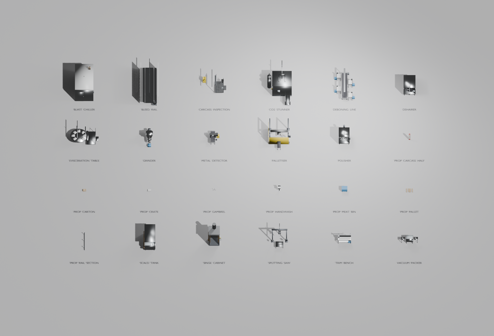

# Butchery line assets

24 FBX files for a pork processing line — 16 stations in process order and 8
props — built parametrically in Blender and verified by re-import.



## What is here

| File | |
|---|---|
| `butchery_lib.py` | Primitives, materials, assembly, rigging, keyframe helpers |
| `butchery_stations.py` | The 16 stations |
| `butchery_props.py` | The 8 props |
| `build_butchery.py` | Runner: build → export → re-import → verify |
| `contact_sheet.py` | Imports every FBX into a grid and renders one sheet |
| `fbx/` | The output |

Rebuild everything from inside Blender:

```
exec(open(r"C:\Users\Metaverse\Documents\PCB_Essen\Tools\butchery\build_butchery.py").read())
```

Set `BUILD = ["GRINDER"]` in the runner to do one.

## The assets

Static meshes:

| Station | Size (m) | Tris |
|---|---|---|
| `CO2_STUNNER` * | 4.51 × 8.20 × 4.31 | 532 |
| `BLEED_RAIL` | 3.28 × 8.53 × 4.01 | 308 |
| `SCALD_TANK` * | 2.22 × 4.40 × 2.60 | 392 |
| `DEHAIRER` * | 2.20 × 3.70 × 2.40 | 660 |
| `SINGE_CABINET` | 2.42 × 2.10 × 4.60 | 392 |
| `POLISHER` * | 2.14 × 2.50 × 2.80 | 1372 |
| `EVISCERATION_TABLE` * | 5.25 × 4.00 × 3.61 | 684 |
| `SPLITTING_SAW` * | 3.10 × 3.20 × 3.91 | 368 |
| `CARCASS_INSPECTION` | 4.33 × 4.00 × 3.61 | 216 |
| `BLAST_CHILLER` * | 3.50 × 6.19 × 4.20 | 788 |
| `DEBONING_LINE` | 3.78 × 6.29 × 2.50 | 784 |
| `GRINDER` * | 1.30 × 3.54 × 1.95 | 716 |
| `VACUUM_PACKER` * | 3.10 × 1.01 × 1.41 | 320 |
| `METAL_DETECTOR` | 1.81 × 2.80 × 1.64 | 376 |
| `PALLETISER` * | 4.13 × 5.25 × 3.22 | 288 |
| `TRIM_BENCH` | 2.41 × 0.90 × 2.09 | 276 |

`*` = skeletal mesh with a baked 2-second animation loop.

Props: `PROP_GAMBREL`, `PROP_RAIL_SECTION` (4 m, tileable), `PROP_CARCASS_HALF`,
`PROP_MEAT_BIN`, `PROP_CRATE`, `PROP_PALLET`, `PROP_CARTON`, `PROP_HANDWASH`.

Total ≈ 9,700 triangles across all 24 — this is blockout-grade geometry sized
off real machinery, meant to be replaced piece by piece, not shipped as final art.

## Why the animated ones are skeletal meshes

Unreal's FBX importer ignores object-level animation on a static mesh. The only
way motion survives the trip is a skeletal mesh, so each moving part is rigid-
skinned to its own bone at weight 1 and the animation is baked onto the bones.

The convention that keeps that simple: **a bone points along its own axis of
motion**. A drum's bone lies along the drum's spin axis, a press's bone along the
stroke — so every pose channel is the bone's local Y and no part needs a special
case.

## Importing into Unreal

Exported with `-Z` forward, `Y` up, unit scale applied, at 1.0 — so the import
defaults are correct and **Import Uniform Scale stays 1.0**. Metres in Blender
arrive as centimetres in Unreal at the right size; if a station comes in 100×
or 0.01×, the scale was changed on the Unreal side, not here.

- Static ones: import as Static Mesh, generate lightmap UVs on.
- Starred ones: import as **Skeletal Mesh** with *Import Animations* ticked.
  Each yields a skeleton plus one looping AnimSequence.

Origins are on the floor at the footprint centre, so an actor placed at a world
position sits on the floor rather than half-buried or floating.

Every mesh has one UV channel from a smart project. It is adequate for material
assignment and as a lightmap source; it is not a hand-laid atlas, and anything
needing tight texel density wants re-unwrapping.

## One quirk worth knowing

`bake_anim` writes object-level `location`/`rotation_euler`/`scale` channels onto
the armature, all keyed at the origin. Harmless in Unreal — it reads as a
zero root-motion track — but it means anything that repositions an imported rig
by setting `location` gets silently overwritten the moment a frame is evaluated.
`contact_sheet.py` uses `delta_location` for exactly this reason.

## Known imprecision

`PROP_CRATE` measures 600 × 410 × 207 mm rather than a flat 600 × 400 × 200: the
hand grips and the rim stand proud of the box, as they do on a real E2 crate.
Everything else is on its nominal dimension.

## Verification

`build_butchery.py` re-imports each FBX after writing it and checks triangle
count, bounding box against the source, UV presence, materials, unit scale, bone
survival, and that at least one animation channel actually moves. All 24 pass
with no problems reported. Measuring the Blender scene alone would not catch an
export setting that quietly drops UVs or halves the scale.
